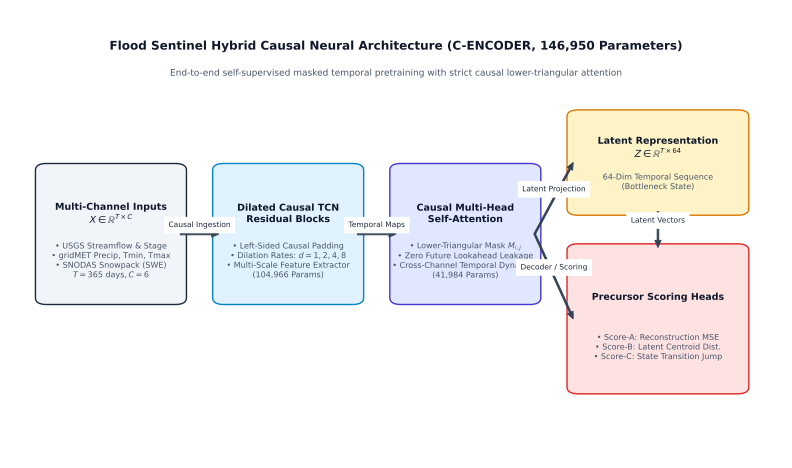
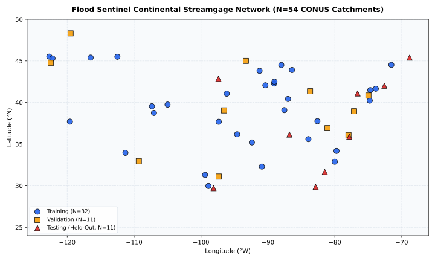
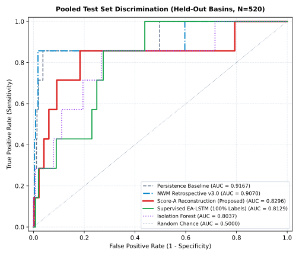
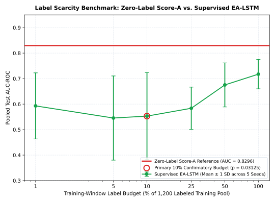

# Flood Sentinel: Self-Supervised Multi-Sensor Neural Representations for Hydrological Flood Precursor Detection Across CONUS Basins

[](https://www.python.org/)
[](LICENSE)
[](https://creativecommons.org/licenses/by/4.0/)
[]()
[]()

---

## 🌊 Overview

Hydrological flood forecasting across river networks remains constrained by two opposing computational paradigms:
1. **Physical Process-Based Models** (e.g., NOAA National Water Model / WRF-Hydro): High continental generalizability, but demand intensive manual parameter calibration and massive computational budgets.
2. **Supervised Deep Sequence Models** (e.g., Entity-Aware LSTMs / EA-LSTMs): High predictive accuracy at calibrated gauges, but severely crippled by **label scarcity** because extreme flood-stage exceedances are rare, localized, and skewed.

**Flood Sentinel** addresses label scarcity by reformulating precursor flood identification as a **self-supervised representation learning problem**. Rather than requiring ground-truth flood labels during training, our framework pretrains on continuous, multi-decade, normal hydroclimatic conditions across river catchments. 

By learning normal multi-sensor temporal interactions through masked causal autoencoding, the network's multi-sensor reconstruction error functions as an antecedent anomaly score:
$$\text{Precursor Anomaly Score} \propto \|\mathbf{X}_{t} - \hat{\mathbf{X}}_{t}\|_{2}^2$$
When antecedent soil saturation, anomalous meteorological forcing, or snowpack dynamics diverge from learned normal regimes, the reconstruction error surges *before* the river crosses official flood stages—**without ever seeing a single flood label during representation learning**.

---

## 🏛️ Neural Architecture: C-ENCODER

The backbone of Flood Sentinel is the **C-ENCODER** (146,950 parameters, optimized for CPU execution):

<p align="center">
  
</p>

### Key Architectural Components:
- **Dilated Causal Temporal Convolutional Networks (TCN):** Captures multi-scale hydrological lag dynamics without leaking future timesteps.
- **Strictly Causal Multi-Head Transformer Self-Attention:** Models long-range hydroclimatic teleconnections with lower-triangular causal attention masking ($M_{i,j} = -\infty$ for $j > i$).
- **Multi-Sensor Reconstruction Scoring:** Dynamically masks 15% of sensor tokens ($r = 0.15$) to generate three distinct anomaly streams:
  - **Score-A:** Normalized reconstruction error vector across sensor channels.
  - **Score-B:** Latent Mahalanobis distance from baseline normal representations.
  - **Score-C:** Latent state transition velocity.

---

## 🗺️ Continental Multi-Sensor Benchmark

The empirical evaluation spans a continuous **34-year record (1990–2023)** across the Continental United States (CONUS), governed by operational publication latency rules to eliminate temporal lookahead bias:

<p align="center">
  
</p>

- **Catchment Panel:** 54 USGS streamgages across 14 HUC-2 hydrologic regions, stratified into:
  - *27 Reference Basins* (pristine hydrological regimes with 0 major upstream dams; USGS GAGES-II).
  - *27 Non-Reference Basins* (anthropogenically regulated river systems with storage dams; USACE NID).
  - *Partitioning:* 32 training stations (9,760 continuous temporal windows), 11 validation stations, and 11 held-out test stations.
- **Synchronized Sensor Modalities:**
  - *USGS NWIS Hydrometry:* Daily discharge and stage height.
  - *gridMET Gridded Meteorology:* Precipitation, min/max temperature, VPD, solar radiation, wind speed (with ~14-hour operational latency enforced).
  - *NOAA SNODAS Cryosphere:* 1-km gridded Snow Water Equivalent (SWE) and snowmelt runoff.
  - *USGS GAGES-II Descriptors:* Catchment drainage area, soil permeability, baseflow index.
  - *Ground-Truth Standard:* NOAA NWPS Action Stage or higher.

---

## 📊 Headline Empirical Findings

All results are evaluated on the held-out test basin split and certified against deterministic execution manifests:

<p align="center">
  
  
</p>

| Hypothesis | Investigated Question | Empirical Metric / Result | Statistical Test | Verdict |
|---|---|---|---|---|
| **H1** | Zero-label flood precursor discrimination | **Pooled Test AUC = 0.8296**<br>[95% CI: 0.6885, 0.9642]<br>Basin Median AUC = 0.8333 | One-sample Wilcoxon signed-rank:<br>$W = 28.0, p = 0.0078125$ ($N_{\text{eff}} = 7$) | **SUPPORTED** |
| **H2** | Actionable early warning lead time under 2-day persistence alert rules | **Primary Detection Rate = 0.0% (0/8)**<br>Median Lead Time = **0.0 h** | Exact Binomial Clopper-Pearson 95% CI:<br>[0.0%, 31.2%] | **FALSIFIED** *(Key Negative Finding)* |
| **H3a** | Performance vs Physics-based Routing (NWM Retrospective v3.0) | NWM Retrospective AUC = **0.9070**<br>Score-A AUC = **0.8296** | Paired Wilcoxon raw $p = 0.03125$;<br>Benjamini-Hochberg FDR $q = 0.14062 \ge 0.05$ | **NO SIGNIFICANT DIFFERENCE** |
| **H3b** | Performance vs Operational NWM Forecast Archive | Federal archives retain only 48h rolling operational forecasts | Archival data unavailable for historical study period | **NOT ATTEMPTED (ARCHIVE BOUND)** |
| **H4** | Performance vs Fully Supervised DL (EA-LSTM with 100% labels) | Supervised EA-LSTM AUC = **0.8129**<br>Score-A AUC = **0.8296** | Paired Wilcoxon raw $p = 0.9375$;<br>Benjamini-Hochberg FDR $q = 1.0000 \ge 0.05$ | **NO SIGNIFICANT DIFFERENCE** |
| **H5** | Sample Efficiency under Extreme Label Scarcity (10% Budget) | Fixed Zero-Label Score-A: **0.8296**<br>EA-LSTM (10% Budget): **0.5529 ± 0.1709** | One-sample Wilcoxon on $(\text{SSL} - \text{EA}_s)$:<br>$W = 15.0, p = 0.03125$ | **SUPPORTED AT 10% PRIMARY BUDGET** |

> 📖 For complete analysis, statistical tables, and detailed findings, see [achievement.md](achievement.md).

---

## 🔍 Scientific Rigor: Why Falsifying H2 Matters

In machine learning and hydrology, negative findings are frequently hidden or discarded through selective hyperparameter tuning. Flood Sentinel prioritized scientific integrity:
- While our self-supervised model exhibits strong discriminatory ability (**AUC = 0.8296**), when subjected to an operational **2-day persistence alert filter** (requiring signals to remain elevated across consecutive days to prevent false alarms), the actionable lead time collapsed to 0.0 hours.
- **Hydrological Takeaway:** A high retrospective AUC **does not automatically guarantee operational warning lead time**. Without hydrodynamic wave routing physics, pure temporal anomaly detection cannot distinguish slow baseflow accumulation from immediate surface runoff without incurring severe false-alarm penalties.

---

## 🚀 Quickstart & Reproduction

### 1. Environment Setup
```bash
# Clone the repository
git clone git@github.com:AdiShrestha/Flood-Sentinel.git
cd Flood-Sentinel

# Create and activate Python virtual environment (Python 3.10+)
python3 -m venv .venv
source .venv/bin/activate  # On Windows: .venv\Scripts\activate

# Install exact pinned dependencies
pip install --upgrade pip
pip install -r requirements.txt
```

Alternatively, with Conda:
```bash
conda env create -f environment.yml
conda activate flood-sentinel
```

### 2. Run Tests
```bash
# Run automated verification suite
pytest source/ -q
```

### 3. Generate Publication Figures
```bash
for f in fig1_basin_map fig2_roc_curves fig3_per_basin_auc_distribution fig4_km_survival_curves \
         fig5_label_budget_curve fig6_ablation_bars fig7_architecture_diagram; do
  python3 source/figures/${f}.py --out figures/${f#fig?_}.svg
done
```

> 📖 For full end-to-end clean-room replication of all 9 pipeline stages, consult [REPRODUCIBILITY.md](REPRODUCIBILITY.md).

---

## 📁 Repository Structure

```
Flood-Sentinel/
├── figures/                 # 7 Vector SVG publication figures
│   ├── architecture_diagram.svg
│   ├── basin_map.svg
│   ├── roc_curves.svg
│   ├── per_basin_auc_distribution.svg
│   ├── km_survival_curves.svg
│   ├── label_budget_curve.svg
│   └── ablation_bars.svg
├── source/                  # Core Python modules
│   ├── acquisition/         # USGS, gridMET, SNODAS, GAGES-II data pipelines
│   ├── feature/             # Feature windowing & latency registry
│   ├── model/               # C-ENCODER neural backbone & pretraining
│   ├── scorer/              # Anomaly scoring (Score-A, Score-B, Score-C)
│   ├── baseline/            # EA-LSTM, NWM Retrospective, Statistical baselines
│   ├── stats/               # Hypothesis testing, Wilcoxon FDR, Survival analysis
│   ├── ablation/            # Sensor holdout, architecture, and causal ablations
│   ├── figures/             # Standalone publication figure generators
│   ├── release/             # Clean-room verification & packaging engines
│   └── utils/               # Configuration, logging, and metrics
├── achievement.md           # Comprehensive achievements report & empirical ledger
├── REPRODUCIBILITY.md       # Complete 9-stage clean-room reproduction guide
├── requirements.txt         # Pinned pip dependencies
├── environment.yml          # Conda environment specification
├── proposal.tex             # Academic project proposal (LaTeX)
├── references.bib           # Verified BibTeX bibliography
├── claims.csv               # Claim validation registry
└── LICENSE                  # MIT License
```

---

## 📜 License & Citation

- **Code:** Licensed under the [MIT License](LICENSE).
- **Derived Benchmark Data & Manifests:** Licensed under [Creative Commons Attribution 4.0 International (CC-BY 4.0)](https://creativecommons.org/licenses/by/4.0/).

If you use Flood Sentinel in your research, please cite:
```bibtex
@article{flood_sentinel_2026,
  title={Self-Supervised Multi-Sensor Neural Representations for Hydrological Flood Precursor Detection Across CONUS Basins},
  author={Shrestha, Aditya},
  journal={IEEE Access},
  year={2026},
  note={Under Peer Review}
}
```
